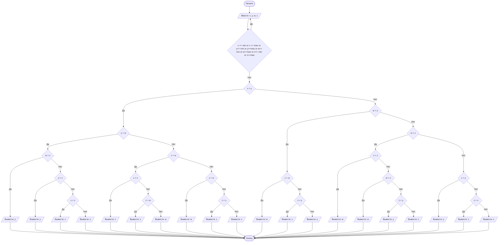

# Lab1
## Отчет по лабораторной работе № 1

#### № группы: `ПМ-2402`

#### Выполнил: `Соколовская Снежана Владимировна`

#### Вариант: `22`

### Cодержание:

- [Постановка задачи](#1-постановка-задачи)
- [Входные и выходные данные](#2-входные-и-выходные-данные)
- [Выбор структуры данных](#3-выбор-структуры-данных)
- [Алгоритм](#4-алгоритм)
- [Программа](#5-программа)
- [Анализ правильности решения](#6-анализ-правильности-решения)

### 1. Постановка задачи

#### Условие задачи 

> На вход программы подается четыре различных целых числа. Вывести на экран число, которое больше одного и меньше двух других чисел (то есть, это число в отсортированной последовательности стояло бы вторым).

#### Уточнение

- Программа получает на вход 4 различных числа. Необходимо найти число, которое будет стоять вторым при расстановке по возрастанию. 
- В поставленной задаче можно изначально рассмотреть два числа (x и y).
- - В первом случае будет (x < y), исходя из этого рассматриваем остальные числа.
- - Во втором случае: (x > y), аналогично проверяем остальные числа на отношение друг к другу.
- Не стоит забывать проверять у каждых из введенных пар чисел отношение друг к другу (< или >). Так как все числа различны третьего отношения (равенства) не будет. 

### 2. Входные и выходные данные

#### Данные на вход

- На вход программа получает 4 различных числа.
- В условиии сказано, что числа целые, поэтому тип данных - целое число
- Диапазон чисел не указан, поэтому установим его самостоятельно.

|             | Тип         |   min значение  |  max значение  |
|-------------|-------------|-----------------|----------------|
| x (Число 1) | Целое число | -10<sup>9</sup> | 10<sup>9</sup> |
| y (Число 2) | Целое число | -10<sup>9</sup> | 10<sup>9</sup> |
| w (Число 2) | Целое число | -10<sup>9</sup> | 10<sup>9</sup> |
| z (Число 2) | Целое число | -10<sup>9</sup> | 10<sup>9</sup> |


#### Данные на выход

Так как программа должна вывести одно число из четырех, минимальное и максимальное значения не изменятся. На выход получаем единственное целое число.

|         | Тип         |    min значение    |  max значение  |
|---------|-------------|--------------------|----------------|
| Число 1 | Целое число |  -10<sup>9</sup>   | 10<sup>9</sup> |


### 3. Выбор структуры данных

Программа получает 4 целых числа, не превышающих по модулю 10<sup>9</sup> < 2<sup>30</sup>. Поэтому для их хранения
можно выделить 4 переменных (`x`, `y`, `w`, `z`) типа `int`.

|             | Название переменной | Тип (в Java)| 
|-------------|---------------------|-------------|
| x (Число 1) |         `x`         |   `int`     |
| y (Число 2) |         `y`         |   `int`     | 
| w (Число 3) |         `w`         |   `int`     |
| z (Число 4) |         `z`         |   `int`     | 

Для вывода результата необязательно его хранить в отдельной переменной.

### 4. Алгоритм

#### Алгоритм выполнения программы:

1. **Ввод данных:**  
   Программа считывает два целых числа, обозначенные как `x`, `y`, `w` и `z`.

2. **Проверка на вхождение в заданный диапазон**
    Если число соответствует условию (входит в диапазон минимум-максимум), работаем с этим числом.
    Если число не входит в заданный диапазон, просим ввести новое значение (так до тех пор, пока не будет введено число, соответствующее заданному диапазону).

3. **Сравнение чисел:**  
    Рассматриваем два случая, где изначально программа сравнивает два числа - `x` и `y`.
    1. Если `x` меньше `y`, предположим расположение введенных чисел в порядке возрастания. К примеру, xywz. Тогда далее разветвляем условия (y < w, w < z) и т.д.
    2. Если `y` меньше `x`, предполагаем расположение zwyx. Аналогично, как в первом случае, разветвляем условия, пока все условия не будут рассмотрены.

3.  **Вывод результата:**  
   На экран выводится одна из переменных: x, y, w или z.

#### Блок-схема



### 5. Программа

```java
import java.io.PrintStream;
import java.util.Scanner;
public class Main {
    // Объявляем объект класса Scanner для ввода данных
    public static Scanner in = new Scanner(System.in);
    // Объявляем объект класса PrintStream для вывода данных
    public static PrintStream out = System.out;
    public static void main(String[] args) {
        // Считывание четырех целых чисел x, y, w и z из консоли
        int x = in.nextInt();
        int y = in.nextInt();
        int w = in.nextInt();
        int z = in.nextInt();
        // Задаем диапазон допустимых значений (минимум и максимум)
        int min = -(int)Math.pow(10, 9);
        int max = (int)Math.pow(10, 9);
        // Проверяем, войдет ли число в заданный диапазон
        if (x <= min || x >= max || y<= min || y>=max ||w<= min || w>=max ||z<= min || z>=max) {
            out.println("Среди введённых чисел есть числ(о/а), не входящ(и/е)е в заданный диапазон `-10^9 <= ваше число <= 10^9`. " +
                    "\nВведите четыре числа, каждое из которых будет входить в диапазон допустимых значений.");
            x = in.nextInt();
            y = in.nextInt();
            w = in.nextInt();
            z = in.nextInt();
        }
        // Рассмотрим первый случай, когда x<y
        if (x<y) 
            // Далее проверяем остальные условия, варианты которые сейчас могут быть: xywz,xyzw,xwzy,xwyz,xzyw,xzwy,zxyw,zxwy,zwxy,wzxy,wxyz,wxzy. (Далее в комментариях будут написаны возможные варианты расстановок)
            if (y < w)
                // xywz,xyzw,zxyw,xzyw
                if (w < z)
                    // xYwz
                    out.print(y);
                else
                    // xyzw,xzyw,zxyw
                    if (y < z)
                        // xYzw
                        out.print(y);
                    else
                        // xzyw,zxyw
                        if (x < z)
                            // xZyw
                            out.print(z);
                        else
                            // zXyw
                            out.print(x);
            else
                // xwyz,xwzy,zxwy,wxzy,wzxy,zwxy,xzwy
                if (x<w)
                // xwyz,xwzy,xzwy,zxwy
                    if (z<x)
                        // zXwy
                        out.print(x);
                    else
                        //xwyz,xwzy,xzwy
                        if (z<w)
                            // xZwy
                            out.print(z);
                        else
                            // xWyz,xWzy
                            out.print(w);
                else
                    // wxyz,wxzy,wzxy,zwxy
                    if (z<w)
                        // zWxy
                        out.print(w);
                    else
                        if (z<x)
                            // wZxy
                            out.print(z);
                        else
                            // wXyz, wXzy
                            out.print(x);
        // Второй случай: x>y
        else
            // Также проверяем остальные условия: yxwz,yxzw,ywxz,ywzx,yzxw,yzwx,zywx,zyxw,zwyx,wzyx,wyxz,wyzx
            if (w<y)
                // wzyx,zwyx,xyzx,wyxz
                if (z<w)
                    // zWyx
                    out.print(w);
                else
                    // wzyx,wyzx,wyxz
                    if (z<y)
                        // wZyx
                        out.print(z);
                    else
                        // wYzx,wYxz
                        out.print(y);
            else
                // yxwz,yxzw,yzxw,zyxw,ywxz,ywzx,yzwx,zywx
                    if (w<x)
                        // ywxz,ywzx,yzwx,zywx
                        if (x<z)
                            // yWxz
                            out.print(w);
                        else 
                            // ywzx,yzwx,zywx
                            if (w<z)
                                // yWzx
                            out.print(w);
                            else
                                // ywzx,yzwx,zywx
                                if (z<y)
                                    // zYwx
                                    out.print(y);
                                else
                                    // yZwx
                                    out.print(z);
                    else
                        // yxwz,yxzw,yzxw,zyxw
                        if (z<y)
                            // zYxw
                            out.print(y);
                        else
                            // yxwz,yxzw,yzxw
                            if (z<x)
                                // yZxw
                                out.print(z);
                            else
                                // yXwz,yXzw
                                out.print(x); 

    }
}
```

### 6. Анализ правильности решения

Программа работает корректно на всем множестве решений с учетом ограничений.

1. Тест на работу с положительными числами

- Input:
    ```
    66 5 8 31
    
    ```

- Output:
    ```
    8
    ```
2. Тест на работу с  отрицательными числами

- Input:
    ```
    -33 -8 -9 -4
    
    ```

- Output:
    ```
    -9
    ```

3. Тест на работу с отрицательными и неотрицательными числами

- Input:
    ```
    -6 8 41 3
   
    ```

- Output:
    ```
    3
  ```
    
Проведем тесты на вывод каждого из заданных чисел (x,y,w,z) 

 4. Тест на вывод x
- Input:
    ```
    54 3848 999 6 
   
    ```

- Output:
    ```
    54
    ```
5. Тест на вывод у
- Input:
    ```
    0 77 987 687
   
    ```

- Output:
    ```
    77
  ```
5. Тест на вывод w

- Input:
    ```
    -10 -1 -6 0
   
    ```

- Output:
    ```
    -6
  ```
6. Тест на вывод z

- Input:
    ```
    224 -556 98541 55
    ```

- Output:
    ```
    55
  ```


7. Тест на ограничения минимума

- Input:
    ```
    -1000000011 99 5 0
    ```

- Output:
    ```
    Среди введённых чисел есть числ(о/а), не входящ(и/е)е в заданный диапазон `-10^9 < ваше число < 10^9`. 
    Введите четыре числа, каждое из которых будет входить в диапазон допустимых значений.
  ```
8. Тест на ограничения максимума

- Input:
    ```
    1000000043 888 96 -1
    ```

- Output:
    ```
    Среди введённых чисел есть числ(о/а), не входящ(и/е)е в заданный диапазон `-10^9 < ваше число < 10^9`. 
    Введите четыре числа, каждое из которых будет входить в диапазон допустимых значений.

  ```
